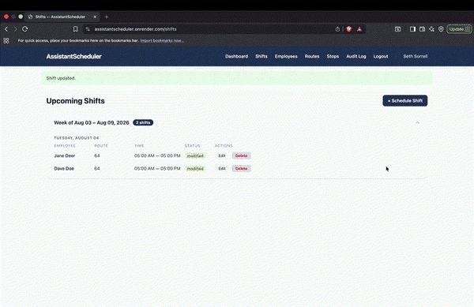

# AssistantScheduler


A shift scheduling and workforce management web app built with Flask, featuring role-based dashboards, live in-app notifications, and full audit logging.



## Overview

AssistantScheduler helps managers build and maintain employee shift schedules while giving employees real-time visibility into their own upcoming work. When a manager creates, edits, or deletes a shift, the affected employee is notified instantly — no page refresh required.

**Live demo:** [assistantscheduler.onrender.com](https://assistantscheduler.onrender.com)

## Features

- **Role-based access control** — separate dashboards and permissions for Managers and Employees (Service Sales Reps, Assistants)
- **Shift management** — create, edit, and delete shifts with route assignment, PPE requirements, and notes
- **Real-time notifications** — powered by Flask-SocketIO with per-user rooms, so updates appear live without polling or refreshing
- **Audit logging** — every create/update/delete action is recorded with the acting user and timestamp, visible to managers
- **Employee & route management** — manager tools for maintaining employee records and delivery routes/stops
- **Shared sign-in** — credentials are verified by a separate identity service (RS256 JWTs checked against its public JWKS); this app never stores passwords
- **Secure sessions** — HttpOnly, Secure, and SameSite-flagged session cookies

## Tech Stack

| Layer | Technology |
|---|---|
| Backend | Python, Flask |
| Real-time | Flask-SocketIO, eventlet |
| Database | PostgreSQL (production), SQLite (local dev) |
| ORM / Migrations | SQLAlchemy, Flask-Migrate (Alembic) |
| Auth | Shared identity-service (Spring Boot, RS256 JWT) for credentials; Flask-Login for the browser session; PyJWT |
| Forms | Flask-WTF |
| Production server | Gunicorn (eventlet worker) |
| Hosting | Render |

## Architecture Notes

- **Notifications** are written to the database *and* pushed live via a `notify_user()` service helper, which emits a SocketIO event scoped to a `user_{id}` room — ensuring updates only ever reach the intended recipient's active session.
- **Blueprints** separate manager and employee routes (`app/manager`, `app/employee`) for clear permission boundaries.
- **Session cookies** are configured with `SameSite=Lax` and `Secure=True` in production to reduce cross-site request risks.

## Signing In

Sign-in is delegated to a shared identity service that also backs my other portfolio apps. This app keeps its own roles table and links each person to their identity by the token's `sub` claim, falling back to email on first login. An account that is already linked to a different identity is refused.

- **Access is by invitation.** A manager adds an employee's email under Employees; that person then signs in with their identity-service account.
- **First sign-in after idle can be slow.** The identity service runs on a free Render instance that sleeps when unused. The app retries for several seconds; if it still shows "The sign-in service is waking up," wait about a minute and try again.

### Local development

Sign-in needs a running identity-service. By default the app looks for it at `http://localhost:8081`; point it elsewhere with the `IDENTITY_URL` environment variable (for example the deployed service's URL).

```bash
export IDENTITY_URL=https://your-identity-service.onrender.com
flask run
```

## Demo Data

`seed_demo.py` fills an empty database with a fictional roster, routes, stops and two weeks of upcoming shifts, so the manager dashboard has something to show.

```bash
python seed_demo.py            # add demo data (safe to re-run)
python seed_demo.py --remove   # delete everything it created
```

Demo people use `@demo.invalid` emails and a placeholder identity link, so no real sign-in can ever be attached to them.

## Getting Started

### Prerequisites

- Python 3.12+
- PostgreSQL (or SQLite for local development)

### Setup

```bash
# Clone the repo
git clone <your-repo-url>
cd CintasSchedulingApp

# Create and activate a virtual environment
python3 -m venv venv
source venv/bin/activate

# Install dependencies
pip install -r requirements.txt
```

### Environment Variables

Create a `.env` file (or export these directly) before running the app:

| Variable | Description | Required |
|---|---|---|
| `SECRET_KEY` | Flask session signing key | Yes |
| `DATABASE_URL` | PostgreSQL connection string | Yes (falls back to local SQLite if unset) |
| `FLASK_ENV` | Set to `production` in deployed environments | Recommended |

### Database Setup

```bash
flask db upgrade
```

### Running Locally

```bash
flask run
```

Visit `http://127.0.0.1:5000` in your browser.

### Running in Production

```bash
gunicorn --worker-class eventlet -w 1 --bind 0.0.0.0:$PORT run:app
```

## Testing

```bash
pytest
```

## Project Structure

```
CintasSchedulingApp/
├── app/
│   ├── employee/       # Employee-facing routes & templates
│   ├── manager/         # Manager-facing routes & templates
│   ├── models.py        # SQLAlchemy models
│   ├── services.py      # Shared service helpers (notifications, audit logging)
│   └── __init__.py      # App factory
├── migrations/           # Alembic migration history
├── tests/                # Test suite
├── config.py              # App configuration
└── run.py                 # Entry point
```

## Roadmap / Possible Next Steps

- Employee self-service shift swap requests
- Email notifications in addition to in-app
- Manager-facing analytics on scheduling patterns

## License

Specify your license here (e.g., MIT).
